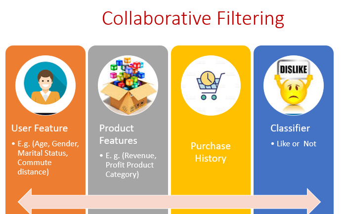
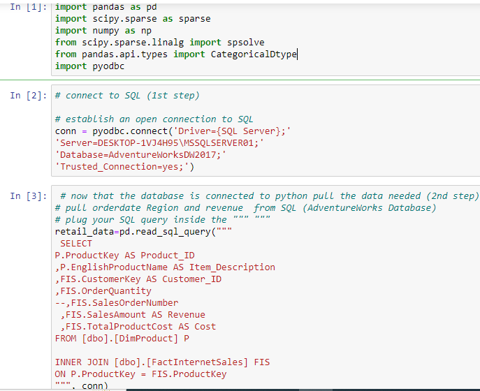
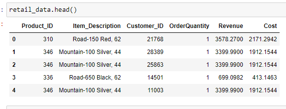
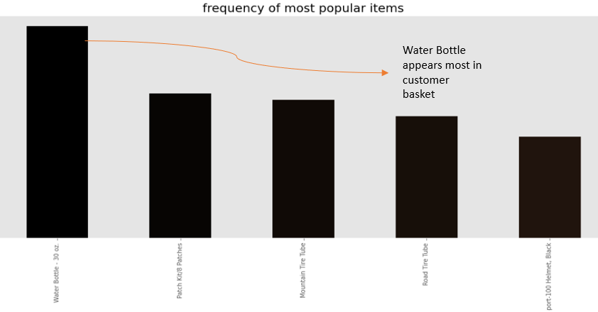
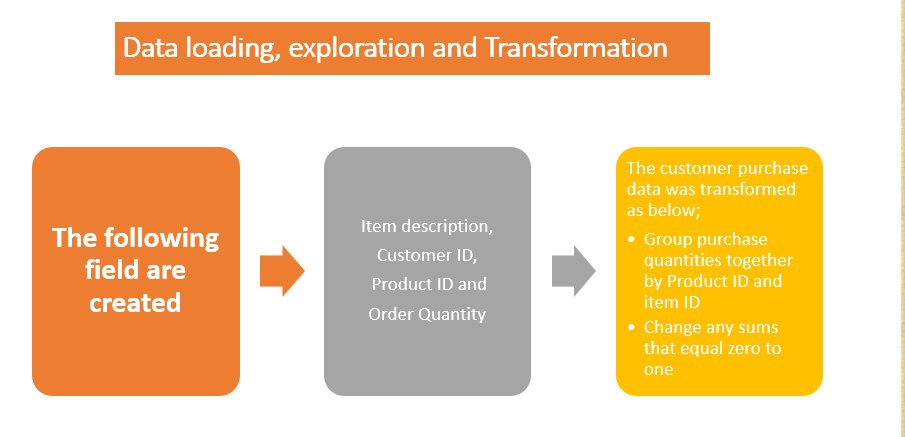
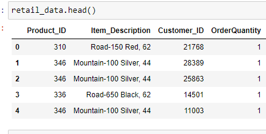
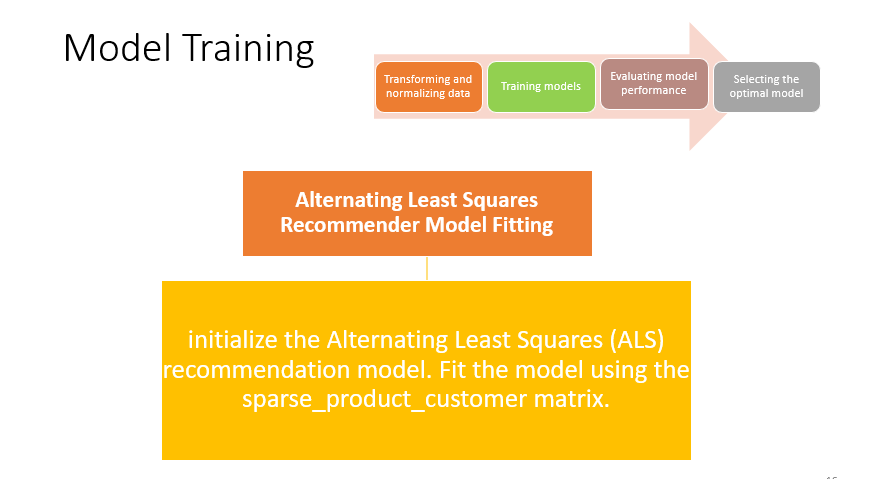
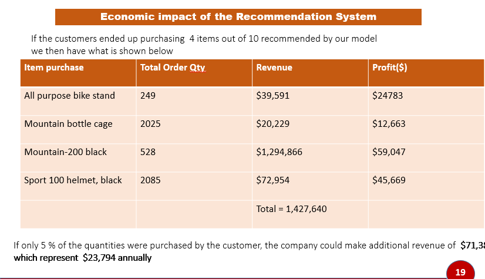
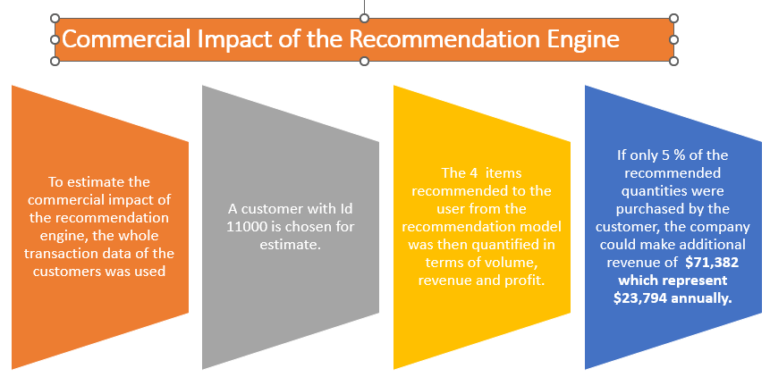

---

## Introduction

---

This project employs a collaborative filtering technique using implicit feedback, which relies on customer-product interactions rather than explicit ratings. Collaborative Filtering (CF) automatically predicts a user's interests by learning from their interactions with available items and comparing them to other users' interactions. In simple terms, CF assumes that if two users agree on certain things, they're likely to agree on new things too. It filters items a user might like based on reactions from similar users. CF scans a large group, identifying a smaller set of users with similar tastes to make recommendations.

---

## Problem Statement
---
To create an automated recommendation engine that offers product suggestions to customers leveraging their purchase history

---

## Data Source and Integration

Once the client database is seamlessly linked to Python using suitable libraries, the data sourcing process begins. This involves crafting precise queries to extract pertinent data, focusing on essential dimensions such as customer ID, order quantity, revenue, and product ID. This strategic data extraction lays the groundwork for subsequent analysis and insights.

Data Source           |  Data Source
:---------------:     |:----------------:
  |   

 ---

 ---

## Skill Demostrated 
For an in-depth overview of how these skills were proficiently utilized to achieve the solution for the problem, kindly consult the project's comprehensive documentation or report. 

---

- Machine Learning Algorithms: Utilizing collaborative filtering with Alternating Least Squares (ALS) demonstrates proficiency in employing advanced machine learning techniques for personalized recommendation systems.

- Data Preprocessing: Cleaning and preparing raw data, transforming it into a suitable format for input into the ALS model.
Feature Engineering: Extracting and engineering relevant features from the data to create meaningful input for the recommendation model.

- Matrix Factorization: Understanding and applying matrix factorization concepts within the ALS framework to decompose user-item interactions.

-  SQL Querying: Crafting appropriate SQL queries to extract specific data dimensions from the database, such as customer ID, order quantity, revenue, and product ID.

-  Model Implementation: Coding the ALS recommendation model, including setting up training, specifying input data, and incorporating necessary libraries (e.g. sparse, spsolve).
-  Model Evaluation: Assessing the ALS model's performance using relevant metrics like root mean square error (RMSE), or area under the receiver operating characteristic curve (AUC-ROC).
  -  Collaborative Filtering: Understanding and applying collaborative filtering principles to make product recommendations based on user-item interactions.

-  Python Programming: Demonstrating proficiency in Python programming for data manipulation, model building, and evaluation.

-  Algorithmic Thinking: Developing a solid understanding of the ALS algorithm's underlying principles and how it applies to recommendation systems.

-  Documentation and Reporting: Summarizing the process, results, and insights gained from the ALS model in a clear and coherent manner for presentation and documentation.

-  Business Understanding: Translating technical results into actionable business insights, showcasing the value of personalized product recommendations for customer engagement and retention.

---
## Methodology
---

-  Data Transformation and Normalization: The initial step involves transforming and normalizing the data to facilitate effective analysis. This includes data preprocessing tasks such as handling missing values, converting categorical variables, and normalizing numerical features.

-  Model Training: Following data preparation, the collaborative filtering technique with implicit feedback is employed. In this approach, no explicit ratings are needed from customers/users; instead, it relies on interactions between customers and products. The training process involves utilizing a sparse matrix containing non-zero interactions between customers and products.

-  Model Evaluation: Once the recommender system is trained, its performance is evaluated using relevant metrics. In this project, an Area Under the Curve (AUC) score of 77.5% is achieved, indicating the system's ability to recommend products based on historic purchases.

-  Optimal Model Selection: The model's performance is thoroughly assessed to determine its effectiveness. Comparisons with benchmarks, such as the popularity-based approach, help establish the system's superiority. An AUC of 0.77 demonstrates that the recommender system consistently suggests items that users have indeed purchased, outperforming items they never bought.

-  Collaborative Filtering with Implicit Feedback: By leveraging collaborative filtering, which focuses on user-product interactions, the recommender system identifies hidden patterns and preferences. This technique enhances product recommendations without requiring explicit ratings from users.

-  Sparse Matrix Implementation: To mitigate memory usage and computational demands, a sparse matrix is employed, featuring non-zero interactions between customers and products. This matrix optimally feeds into the Alternating Least Squares (ALS) model, contributing to efficient analysis and recommendation generation.

-  Historic Purchase-Based Recommendations: The trained recommender system effectively predicts the next best product for customers based on their historical purchase behavior. This personalized approach enhances user engagement and satisfaction.
---
## Exploratory Data Analysis (EDA) 
---
Through exploratory data analysis, we delved deeper into the dataset, examining it from diverse perspectives. Our focus included detecting missing values, identifying duplicate entries, and transforming data to align with the requirements of our product recommendation model. These transformations encompassed tasks such as converting customer IDs into categorical data and grouping purchase quantities by Product_ID and item ID.
In our data preparation process, we made adjustments to ensure robustness. Specifically, we converted zero-sum interactions to one, indicating actual purchases instead of assuming no engagement. Furthermore, we filtered out customers with non-positive purchase totals to enhance data accuracy.
To facilitate the subsequent recommendation model, we structured a sparse ratings matrix. This matrix forms a foundation for our collaborative filtering approach, which will be instrumental in generating effective product recommendations.

exploration1           |  exploration2
:---------------:     |:----------------:
  |   

 ---

## Feature Engineering: 
 

---
Extracting and engineering relevant features from the data to create meaningful input for the recommendation model.

---
## Model Selction
---
### Alternating Least Squares (ALS) 

ALS is chosen as the collaborative filtering technique. It involves decomposing the sparse matrix into user and item latent factors to capture underlying patterns and preferences.

---
## Model Training with Alternating Least Squares (ALS)
---

To harness the power of collaborative filtering, the Alternating Least Squares (ALS) recommendation model is initialized and subsequently trained using the sparse_product_customer matrix. This matrix, which encapsulates non-zero interactions between products and customers, serves as the cornerstone of the ALS model's learning process. By fitting the ALS model to this specialized matrix, we enable it to uncover latent factors and intricate patterns within user-product interactions, ultimately empowering the model to provide accurate and personalized product recommendations.

---

## Model Evaluation using AUC for ALS (Alternating Least Squares Model)
---

In the process of assessing the performance of our recommendation engine, we employed the AUC (Area Under the Receiver Operating Characteristic Curve) metric. AUC serves as a valuable gauge of the model's predictive accuracy, with higher values indicating better performance. An exceptional model is characterized by an AUC value closer to 1.

In our case, the ALS model achieved an AUC of 0.77. This outcome signifies that the recommendation system excels in suggesting items that the user had indeed purchased from the test set, surpassing items the user never engaged with. This performance demonstrates the model's proficiency in accurately predicting user preferences and enhancing the quality of product recommendations. While not perfect, the achieved AUC of 0.77 underscores the efficacy and reliability of our ALS-based recommendation system.

---
## Economic Impact
---
exploration1           |  exploration2
:---------------:     |:----------------:
  |   

To gauge the potential commercial influence of the recommendation engine, the entirety of customer transaction data was harnessed. Specifically, we selected Customer ID 11000 as our focal point for estimation.

Upon employing the recommendation model, four distinct items were suggested to this customer. These recommendations were further quantified in terms of their volume, revenue, and profit implications. Notably, if a mere 5% of the recommended quantities were procured by the customer, a significant boost in revenue would ensue.

The estimated result suggests a substantial additional revenue of $71,382, equivalent to an annual increment of $23,794. This noteworthy enhancement underscores the considerable potential of our recommendation engine to drive increased revenue, showcasing its promising commercial impact.

---

## Recommendation Strategy:
---

Personalized Promotions: Utilize the product recommendations generated by our model to identify items of interest for each buyer. Craft tailored promotions related to these recommended products, ensuring that marketing efforts resonate with individual preferences and increase the likelihood of purchases.

Engagement Through Feedback: Actively engage with customers by seeking their input and feedback on our product range and specifications. Encourage them to provide insights into their preferences and suggestions for improvements. This interaction not only fosters a sense of involvement but also rekindles their interest and connection with our offerings.
